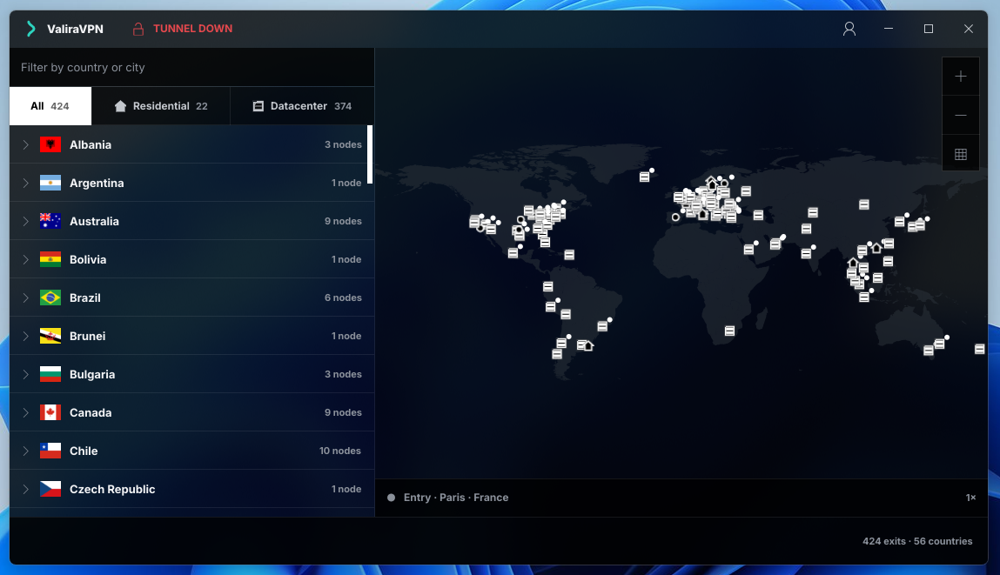

# ValiraVPN for Desktop (Windows/Linux)

**ValiraVPN for Desktop** is the official ValiraVPN app for desktop platforms. Some of the
features include: an embedded WireGuard tunnel that needs nothing installed alongside it,
residential and datacentre exits told apart and filterable, a world map drawn on the CPU
with no GPU and no map tiles, an acrylic frame with Snap Layouts on Windows, and a
notification area icon that keeps the tunnel up while the window is away.
ValiraVPN accounts are managed on the official site [valiravpn.com](https://valiravpn.com).

* [About this Repo](#about-this-repo)
* [Installation](#installation)
  * [Requirements](#requirements)
  * [Compilation](#compilation)
* [Configuration](#configuration)
* [Versioning](#versioning)
* [Contributing](#contributing)
* [Security Policy](#security-policy)
* [License](#license)
* [Authors](#authors)
* [Acknowledgements](#acknowledgements)

## About this Repo

The desktop client, written in Rust with [Slint](https://slint.dev) for the interface.

    ui/            design tokens, widget vocabulary, the three screens
    src/api.rs     the control plane at valiravpn.com
    src/tunnel/    two backends behind one interface
    src/worldmap/  coastline vectors rasterised on the CPU
    installer/     Inno Setup script for the Windows installer

How the tunnel, the exit list and the map work, and the measurements behind those
decisions, are in [docs/design.md](docs/design.md).

## Installation

Windows binaries are published with each release. Take the installer from the
[latest release](https://github.com/ValiraVPN/valiravpn-desktop/releases/latest); a
SHA-256 checksum is published beside it. Linux and macOS are built from source.

### Requirements

**Windows.** Nothing. WireGuard for Windows is used when present and the embedded tunnel
takes over when it is not. `wintun.dll` ships beside the executable.

**Linux.** Build dependencies:

    build-essential pkg-config libfontconfig-dev
    libxkbcommon-dev libxkbcommon-x11-dev
    libwayland-dev wayland-protocols
    libx11-dev libxcursor-dev libxrandr-dev libxi-dev
    libgl1-mesa-dev libegl1-mesa-dev

`libxkbcommon-x11` is also needed at run time, without which the client exits before
drawing anything. See [BUILDING-LINUX.md](BUILDING-LINUX.md) for what is not implemented
there yet.

**macOS.** `wireguard-tools` from Homebrew is used when present, and is not required.

### Compilation

    cargo build --release
    cargo test --lib

The Windows installer is built from `installer/valira.iss` with Inno Setup 6.

The executable carries a manifest asking for administrator rights, so `cargo run` is
refused from an ordinary shell with `ERROR_ELEVATION_REQUIRED`. Build and test are not
affected. Run it from an elevated terminal, or:

    Start-Process .\target\release\valira-desktop.exe -Verb RunAs

On Linux and macOS, run it with `sudo`: creating a tunnel interface is privileged.

## Configuration

    VALIRA_API             control plane, defaults to https://valiravpn.com
    VALIRA_WIREGUARD       path to wireguard.exe, Windows only
    VALIRA_TUNNEL          pins the backend: embedded or system
    VALIRA_RENDERER        pins the renderer: software or gpu
    VALIRA_TUNNEL_TRACE    per-packet timings, written to the temp directory
    VALIRA_UI_PREVIEW      opens one screen with sample data and no account

The session is kept in the platform configuration directory, readable only by the
current user. It holds the account number, the token and the device private key.
Signing out removes it and revokes the device.

    Linux    ~/.config/valira/session.json
    macOS    ~/Library/Application Support/com.ValiraVPN.valira/session.json
    Windows  %APPDATA%\ValiraVPN\valira\config\session.json

## Versioning

[Semantic Versioning](https://semver.org). Pushing a `vX.Y.Z` tag builds the Windows
installer and publishes a release. The tag is checked against `Cargo.toml` first, so an
installer can never advertise a version its executable does not carry.

## Contributing

See [CONTRIBUTING.md](.github/CONTRIBUTING.md). Note that contributions are licensed on
the terms in [LICENSE.md](LICENSE.md), which reserve commercial use to ValiraVPN.

## Security Policy

Do not report vulnerabilities through public issues. See
[SECURITY.md](.github/SECURITY.md).

The WireGuard private key is generated on the machine and never leaves it. Only its
public half travels, when signing in creates the device.

## License

PolyForm Noncommercial 1.0.0, in [LICENSE.md](LICENSE.md). Anyone may read, run, modify
and share this source for any purpose that is not commercial. Commercial use is reserved
to ValiraVPN. This is a source-available licence rather than an open source one, since it
restricts the field of use.

## Authors

See [AUTHORS](AUTHORS).

## Acknowledgements

ValiraVPN for Desktop is built on the work of others, named in
[ACKNOWLEDGEMENTS.md](ACKNOWLEDGEMENTS.md).
